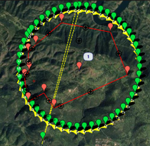

[](https://zenodo.org/doi/10.5281/zenodo.10731036)

Fernando Pérez Porras

# Capitulo 19: Uso de UAS para la obtención de información operativa en incendios forestales

## 1. Calcular en R los parámetros del vuelo

Se calculan los parámetros de vuelo para fotogrametría. Con este código se calcula el tamaño de píxel, el tamaño de la imagen sobre el terreno y la distancia entre imágenes para la cual hay que capturar imágenes para disponer de un solape del 80% longitudinal. Todos los datos de la cámara están en mm y las distancias o alturas en metros.

```r
#Características de las camaras
Ancho_Sensor = 10.88
focal = 13
image_weight = 640
image_height = 480
Altura_vuelo = 120
GSD = (Ancho_Sensor*Altura_vuelo*100)/(focal*image_weight)
print("el GSD es: ",GSD)
```

```r annotate
[1] "el GSD es: 15.6923076923077
```

```r
Ancho_imagen = GSD*image_weight/100
print("El ancho de imagen en metros es: ",Ancho_imagen)
```

```r annotate
[1] "El ancho de imagen en metros es: 100.430769230769"
```

```r
Alto_imagen = GSD*image_height/100
print("El alto de imagen en metros es: ",Alto_imagen)
```

```r annotate
[1] "El alto de imagen en metros es: 75.3230769230769"
```

```r
Solape = 0.8*Alto_imagen
Solape
```

```r annotate
[1] 60.25846
```

```r
#La velocidad de la plataforma son 5 m/s
velocidad = 5
trigger = (Alto_imagen - Solape)/velocidad
print("el trigger es cada X segundos: ",trigger)
```

```r annotate
[1] "el trigger es cada X segundos: 3.01292307692308"
```

Pregunta: ¿Si la camara puede capturar 1 frame cada dos segundos, es posible con este solape y esta velocidad, generar ese trigger o velocidad de disparo de la cámara?

Genere usted el código para analizar la anchura entre pasadas para un solape del 40%

## 2. Diseño del plan de vuelo con un planificador de misión de código abierto

Una vez calculados los parámetros de vuelo según el tipo de misión explicada en este capítulo, se procederá al diseño de la misión de captura de datos propiamente dicho. El primer objetivo de esta tarea será descargar e instalar Mission Planner, el cual se puede descargar de la web de Mission Planner de Ardupilot. (https://ardupilot.org/planner/docs/mission-planner-installation.html).

El segundo objetivo será leer la documentación de cómo diseñar un plan de vuelo con dicha herramienta. Como resumen y/o guía rápida hay que seguir los siguientes pasos para el diseño de un plan de vuelo con la herramienta de diseño de misión de un autopiloto y son las siguientes:
- Definir la zona de vuelo con un polígono
- Definir el tipo de cámara
- Definir el tipo de vuelo
- Generar el plan de vuelo con waypoints y tareas en los mismos
- Exportar el plan de vuelo

 #### Demostración de cómo realizar un plan de vuelo de fotogrametría

1. Para la resolución de la tarea hay que entrar en los iconos de la esquina superior izquierda y pulsar en PLAN.


2.	Definir la localización de la casa o del punto de partida del UAS. Introducir las coordenadas y el cursor verde del UAS se irá hasta ese punto.


3.	Dibujar polígono de la zona de vuelo

Para ello pulsar botón derecho/Dibujar un polígono/ Draw a Polygon/

En la siguiente imagen se aprecia el punto de partida del UAS y la zona a sobrevolar en rojo. Todavía se desconocen las pasadas, así como los waypoints, en este momento del diseño.


4.	Diseño de los waypoints

Se pulsa botón derecho, Autowapoint y se elige la opción Survey Grid.

Se podrán elegir las características de las cámaras en camera config, calculados en la tarea anterior.

En el modo simple, se elige la cámara, altitud de vuelo, ángulo respecto al norte de las pasadas y velocidad de vuelo. Se obtiene algo como esto.


En la imagen se aprecian todos los Waypoint en verde, el sentido de avance del UAS en cada pasada y en la parte inferior viene un resumen del área de vuelo, distandcia recorrida, distancia entre pasadas, resolución del píxel, número de imágenes capturadas, tamaño de la imagen sobre el terreno y tiempo de vuelo para realizarlo.


En este caso el Área sobrevolada para el vuelo de fotogrametría es 418 hectáreas, con un recorrido de 30 km, un tamaño de píxel de 65 cm a 500 metros de altura (así podemos validar la tarea anterior) y el tamaño de imagen (la cual también podemos validar) así como el tiempo de vuelo, 43 minutos y el tiempo entre imagen, 11 segundos.

Al aceptar se generan unos waypoints que se pueden exportar su coordenada latitud, longitud y altitud en el Sistema de Referencia, WGS84.


#### Tareas a realizar

Diseñar dos tipos de plan de vuelo para la realización de captura de información según el tipo de misión observación y fotogrametría:

1.	Para la misión de fotogrametría, usar Waypoint GRID usar los parámetros siguientes:
   - Solape longitudinal: 60 %
   - Solape transversal: 50
   - Sensor RGB
     - Resolución
     - Tamaño del sensor
     - Focal
   - Sensor termográfico
     - Resolución
     - Tamaño del sensor
     - Focal
   - Altura de vuelo: 1500 pies metros

2.	Para la misión de observación usar el perímetro de un incendio teórico (creado a mano) sobre una zona forestal de Córdoba y generar un tipo de vuelo en órbita alrededor de él. Sugerencia: Buscar Create Circle Survey y modificar sus parámetros. El resultado será algo similar al siguiente plan de vuelo




 
